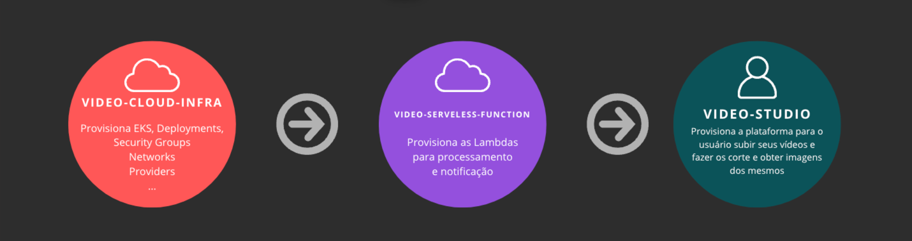

# Funções Video Studio

Este é um repositório git que utiliza as configurações anteriormente criadas pelo repositório [https://github.com/ALFAC-Org/video-cloud-infra](https://github.com/ALFAC-Org/video-cloud-infra) para aplicar as configurações faltantes para a provisão de recursos de *funções lambdas* ou *funções serveless*  da aplicação [Video Studio](https://github.com/ALFAC-Org/video-studio). Nele, você encontrará as lambdas que são executadas na aplicação, bem como o fluxo para a atualização destes códigos. No momento, o repositório está focado na Amazon Web Services (AWS), usando as funções lambdas. Entretanto, o repositório é flexível para adaptação para outros provedores de funções serveless.

> [!WARNING]
> Para completo funcionamento da plataforma, é necessário seguir todo o fluxo de provisionamento:
> 1. A provisão da infraestrutura [https://github.com/ALFAC-Org/video-cloud-infra](https://github.com/ALFAC-Org/video-cloud-infra);
> 2. A provisão das lambdas [https://github.com/ALFAC-Org/video-serveless-function](https://github.com/ALFAC-Org/video-serveless-function);
> 2. A provisão da aplicação [https://github.com/ALFAC-Org/video-studio](https://github.com/ALFAC-Org/video-studio)

## Conceito

Toda a infraestrutura é criada no repositório [https://github.com/ALFAC-Org/video-cloud-infra](https://github.com/ALFAC-Org/video-cloud-infra), haja visto que é necessário a provisão de recursos compartilhados entre os projetos, como VPC, grupos de acesso e entre outros. Com isso, este repositório fica responsável por de fato, atualizar o código que será utilizado pela a aplicação.

De modo geral, as lambdas ficarão responsáveis por provisionar:

- o processamento do vídeo enviado;
- a notificação para o usuário em caso de falhas.

Tudo isso dentro da plataforma [Video Studio](https://github.com/ALFAC-Org/video-studio).

## Como rodar o projeto

- **Via GitHub Actions**

  
Passo a passo

1. Acesse [https://github.com/ALFAC-Org/video-serveless-function/actions](https://github.com/ALFAC-Org/video-serveless-function/actions) (A guia `Actions` deste repositório);
2. Acesse `Deploy to AWS Lambda`;
3. Clique em `Run workflow` (ou Executar workflow);
4. Aguarde. Se tudo der certo, o `check` verde deverá aparecer - o processo dura em torno de 2 a 5 minutos;
   1. 
   2. 

[TODO]

### Recursos provisionados

Os seguintes recursos serão criados/atualizados:

- Lambdas: novo código/versão, bem como variáveis ambiente necessárias para estas lambdas.

### Acessando as lambdas

Você saberá que tudo estará bem, quando acessar a aplicação principal [https://github.com/ALFAC-Org/video-studio](https://github.com/ALFAC-Org/video-studio) acessando a url do Load Balancer e então seguindo o fluxo para o upload e processamento do vídeo.

Ou então acessando ao console AWS e verificando pelas lambdas criadas.

## Documentação técnica das Lambdas

Para mais detalhes sobre as funções Lambda, consulte:
- video_slicer: [documentação](video_slicer/README.md)
- envia_email_erro_processamento //TODO: documentação

## Membros

| Nome | RM | E-mail | GitHub |
| --- | --- | --- | --- |
| Leonardo Fraga | RM354771 | [rm354771@fiap.com.br](mailto:rm354771@fiap.com.br) | [@LeonardoFraga](https://github.com/LeonardoFraga) |
| Carlos Henrique Carvalho de Santana | RM355339 | [rm355339@fiap.com.br](mailto:rm355339@fiap.com.br) | [@carlohcs](https://github.com/carlohcs) |
| Leonardo Alves Campos | RM355568 | [rm355568@fiap.com.br](mailto:rm355568@fiap.com.br) | [@lcalves](https://github.com/lcalves) |
| Andre Musolino | RM355582 | [rm355582@fiap.com.br](mailto:rm355582@fiap.com.br) | [@amusolino](https://github.com/amusolino) |
| Caio Antunes Gonçalves | RM354913 | [rm354913@fiap.com.br](mailto:rm354913@fiap.com.br) | [@caio367](https://github.com/caio367) |
