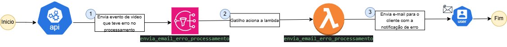

# Lambda Email Notification
Função Lambda para envio de notificações por email em caso de erro no processamento de vídeos.

## Desenho do fluxo de trabalho da Lambda



## Visão Geral
Este projeto utiliza uma função AWS Lambda para enviar e-mails automáticos quando ocorre um erro no processamento de vídeos. A função:
- É acionada por uma mensagem recebida via **Amazon SNS**.
- Extrai o e-mail do usuário e o nome do vídeo da mensagem SNS.
- Envia um e-mail de notificação informando sobre o erro.

## Tecnologias Utilizadas
- **AWS Lambda** - Executa a função automaticamente.
- **Amazon SNS** - Aciona a Lambda ao detectar um erro.
- **Nodemailer** - Biblioteca para envio de emails via SMTP.
- **Gmail SMTP** - Utilizado para envio dos emails de notificação.

## Fluxo de Processamento
1. Uma mensagem **SNS** aciona a função Lambda.
2. A função extrai os atributos **email** e **video_name** da mensagem recebida.
3. O email é enviado ao destinatário informando sobre o erro.
4. Logs são gerados para monitoramento.

## Exemplo de Mensagem SNS Recebida
```json
{
  "Records": [
    {
      "Sns": {
        "MessageAttributes": {
          "email": { "Value": "usuario@example.com" },
          "video_name": { "Value": "meu_video.mp4" }
        }
      }
    }
  ]
}
```

## Tratamento de Erros
- Se houver falha no envio do e-mail, o erro é registrado nos logs.
- Caso os atributos esperados não estejam na mensagem SNS, a função gerará um erro nos logs.

## Conclusão
Essa função permite o envio automático de emails para notificar falhas no processamento de vídeos, garantindo comunicação eficiente com os usuários. 🚀