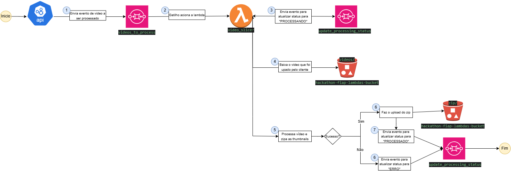

# Lambda video_slice
Função Lambda para processar vídeos enviados para um bucket S3.

## Desenho do fluxo de trabalho da Lambda



## Visão Geral
Este projeto utiliza uma função AWS Lambda para processar vídeos enviados para um bucket S3. A função:
- Recebe uma mensagem da fila SQS informando o nome do vídeo a ser processado.
- Baixa o arquivo ZIP contendo o vídeo do S3.
- Extrai o arquivo ZIP e encontra o vídeo MP4.
- Gera thumbnails do vídeo em intervalos regulares.
- Compacta os thumbnails em um novo arquivo ZIP e envia de volta ao S3.
- Atualiza o status do processamento em uma fila SQS.

## Tecnologias Utilizadas
- **AWS Lambda** - Executa a função automaticamente.
- **Amazon S3** - Armazena os vídeos e os thumbnails gerados.
- **Amazon SQS** - Gerencia as mensagens de processamento e status.
- **OpenCV (cv2)** - Extrai thumbnails dos vídeos.
- **boto3** - Biblioteca para interação com os serviços da AWS.

## Configuração
Antes de executar o código, certifique-se de definir as seguintes variáveis de ambiente na AWS Lambda:

```plaintext
TO_PROCESS_QUEUE_URL=<URL_da_fila_SQS_para_processamento>
STATUS_QUEUE_URL=<URL_da_fila_SQS_para_status>
BUCKET_FILES_NAME=<Nome_do_Bucket_S3>
```

## Fluxo de Processamento
1. A função Lambda é acionada por uma mensagem na fila **TO_PROCESS_QUEUE_URL**.
2. O nome do vídeo é extraído da mensagem.
3. O status do vídeo é atualizado para **PROCESSANDO** na fila **STATUS_QUEUE_URL**.
4. O arquivo ZIP do vídeo é baixado do S3 e extraído.
5. O arquivo MP4 dentro do ZIP é identificado.
6. Thumbnails são gerados a cada **20 segundos** de vídeo.
7. As imagens são compactadas em um novo arquivo ZIP.
8. O ZIP contendo os thumbnails é enviado de volta para o S3.
9. O status do vídeo é atualizado para **PROCESSADO** na fila **STATUS_QUEUE_URL**.
10. A mensagem processada é removida da fila **TO_PROCESS_QUEUE_URL**.

## Status de Processamento
Durante o fluxo, o status do vídeo será atualizado na fila **STATUS_QUEUE_URL** com os seguintes valores:
- **PROCESSANDO**: O vídeo está sendo processado e os thumbnails estão sendo gerados.
- **PROCESSADO**: O processamento foi concluído e os thumbnails foram enviados para o S3.
- **ERRO**: Ocorreu um erro durante o processamento do vídeo.

## Execução

Em um ambiente AWS, a função Lambda será acionada automaticamente quando uma mensagem for enviada para a fila configurada.

## Erros e Tratamento de Exceções
- Se o arquivo não for encontrado no S3, um erro será gerado.
- Se o vídeo não puder ser processado, o status será atualizado para **ERRO** na fila SQS.
- Se ocorrer qualquer outra exceção, a mensagem será retornada com um código de erro HTTP 500.

## Conclusão
Este projeto automatiza a extração de thumbnails de vídeos enviados para o Amazon S3 utilizando AWS Lambda e SQS, garantindo um fluxo eficiente e escalável. 🚀

-----------------------------------------------------------------------------------------------------------------------------------------------------------------

